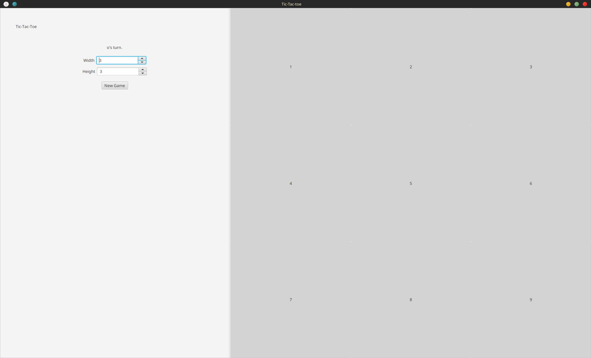
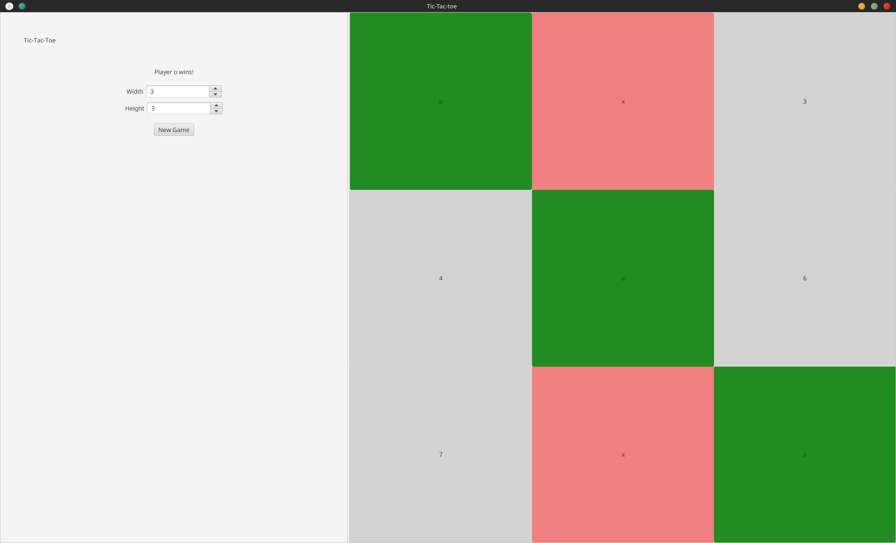
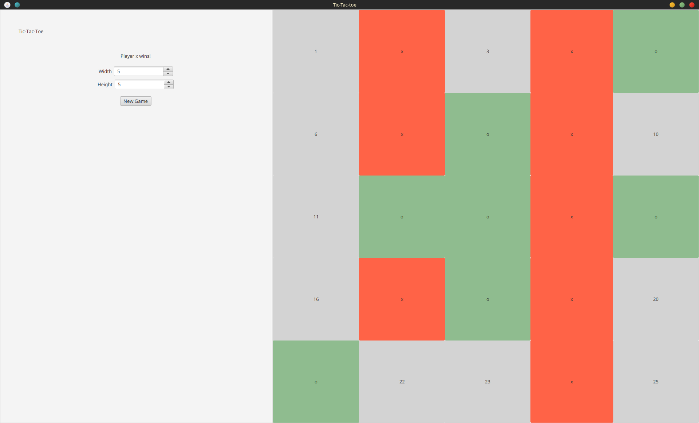

# tic-tac-toe

- Project to learn Clojure, a functional Lisp on the JVM.
  - https://clojure.org/
- GUI made with cljfx, a JavaFX wrapper.
  - https://github.com/cljfx/cljfx

## Installation
- Download a Jar file from releases page.

## Images

## License

Copyright © 2022 Sammy Shea

This program and the accompanying materials are made available under the
terms of the Eclipse Public License 2.0 which is available at
http://www.eclipse.org/legal/epl-2.0.

This Source Code may also be made available under the following Secondary
Licenses when the conditions for such availability set forth in the Eclipse
Public License, v. 2.0 are satisfied: GNU General Public License as published by
the Free Software Foundation, either version 2 of the License, or (at your
option) any later version, with the GNU Classpath Exception which is available
at https://www.gnu.org/software/classpath/license.html.
